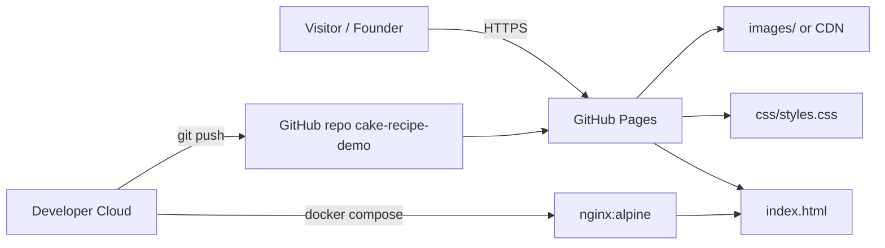

# System flow — cake-recipe-demo

```mermaid
flowchart LR
  V[Visitor / Founder] -->|HTTPS| GP[GitHub Pages]
  GP --> HTML[index.html]
  GP --> CSS[css/styles.css]
  GP --> IMG[images/ or CDN]

  DEV[Developer Cloud] -->|docker compose| NGX[nginx:alpine]
  NGX --> HTML

  DEV -->|git push| GH[GitHub repo cake-recipe-demo]
  GH --> GP
```

**Trust boundary:** Static host only. No auth, no API, no DB.
